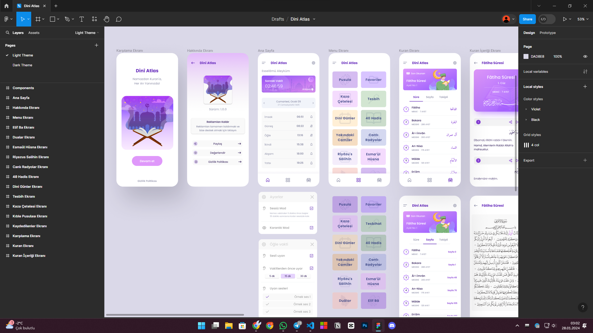
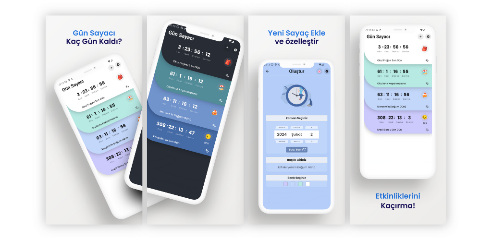
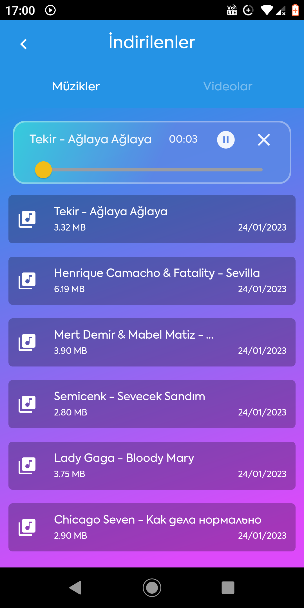
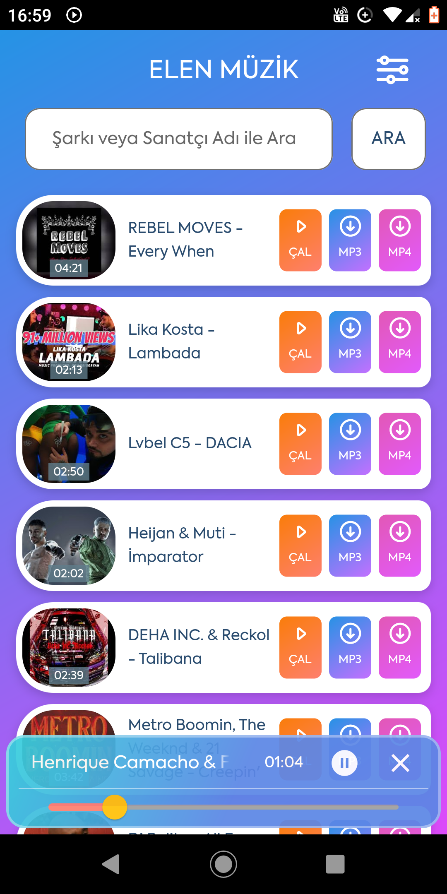
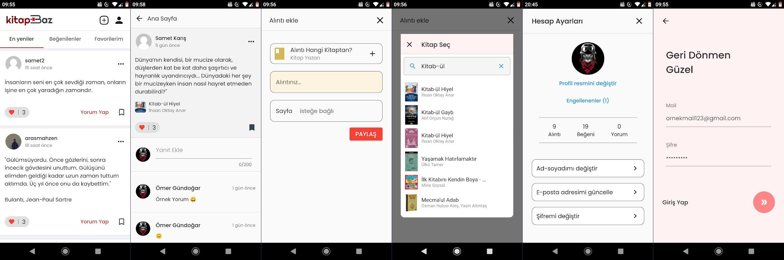

## Ömer Gündoğar
### Flutter Developer

**[GitHub](https://github.com/ruwiss) - [LinkedIn](https://www.linkedin.com/in/omergundgr/) - [R10](https://www.r10.net/profil/118273-omergundogar.html)**

**[YouTube (Ruwis)](https://www.youtube.com/@druwis/videos) - [YouTube (Softzone)](https://www.youtube.com/@softzonetr/videos)**

**[Kodlayalim.net](https://kodlayalim.net/)**

## Örnek Projeler
**Ezan Vakti ve Kuran - Dini Atlas**
 
 
**[Github (Private)](https://github.com/ruwiss/dini_atlas)**
 
**[Play Store](https://play.google.com/store/apps/details?id=com.rw.dini_atlas)**
 
 

 
 
___
**Gün Sayacı: Kaç Gün Kaldı?**
 
**[Play Store](https://play.google.com/store/apps/details?id=com.rw.gunsayaci)**
 
**[Github (Private)](https://github.com/ruwiss/gun_sayaci)**
 
Kullanıcıların özel günlerini planlayarak kalan süreyi geri sayım olarak görmesini ve bildirim ile hatırlatmayı amaçlar.
 
 

 
 

___

**Kaç Kişiyiz? Anket Uygulaması**
 
Yeni nesil eğlenceli anketlerle kullanıcıların güzel vakit geçirmesini sağlayıp pasif gelir elde etmelerini amaçlar.
 
**[Github (Private)](https://github.com/ruwiss/kac_kisiyiz)**
 
 
Uygulama Videosu           |  Panel Videosu
:-------------------------:|:-------------------------:
  |  

___

**Blogspot Mobile**
 
Google'ın [Blogger.com](https://blogger.com) servisinin API'ını kullanan bir blog yazma uygulaması
 
 
**[Play Store](https://play.google.com/store/apps/details?id=com.rw.blogspot)**
 
**[Github (Private)](https://github.com/ruwiss/blogspot_mobile)**
 
 

 
 
*Uygulama Videosu*
 

 
 

___

**Music Downloader (MeloTune)**
 
YouTube API ve harici API kullanarak popüler müziklerden haberdar olma, müzikleri mp3, mp4 formatında indirme ve oynatma listeleri oluşturmayı sağlar.
 
 
**[GitHub Bağlantısı](https://github.com/ruwiss/flutter_music_video_downloader)**
 
 
Uygulama Videosu         |  Panel Videosu
:-------------------------:|:-------------------------:
  |  
 
 

___

**Music Downloader (Elen Music)**
 
YouTube API ve harici API kullanarak popüler müziklerden haberdar olma, müzikleri mp3, mp4 formatında indirme ve oynatma listeleri oluşturmayı sağlar.
 
 
**[Play Store](https://play.google.com/store/apps/details?id=com.rw.music_app)**
 
**[GitHub (Private)](https://github.com/ruwiss/elen_music)**
 
Resim 1            |  Resim 2
:-------------------------:|:-------------------------:
  |  
 
 

___

**Soru Havuzu - Açıköğretim**
 
 
**[Play Store](https://play.google.com/store/apps/details?id=com.ozan.aofsorular)**
 
**[Github (Private)](https://github.com/ruwiss/soru_havuzu)**
 
 
Uygulama Videosu          |  Panel Videosu
:-------------------------:|:-------------------------:
  |  
 

___
**Lingo - İngilizce Sesli Pratik**
 
 
**[Play Store](https://play.google.com/store/apps/details?id=com.ruwis.lingo)**
 
**[Github (Private)](https://github.com/ruwiss/lingo)**
 
 

 
 
___

**KitapBaz - Kitap Alıntıları**
 
Kitap alıntıları Sosyal Platform
 
 
**[Github](https://github.com/ruwiss/kitapbaz_os)**
 
 

 
 
___
